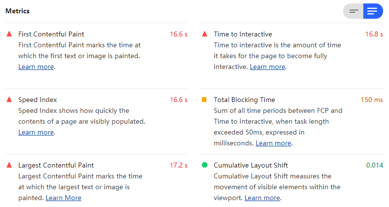
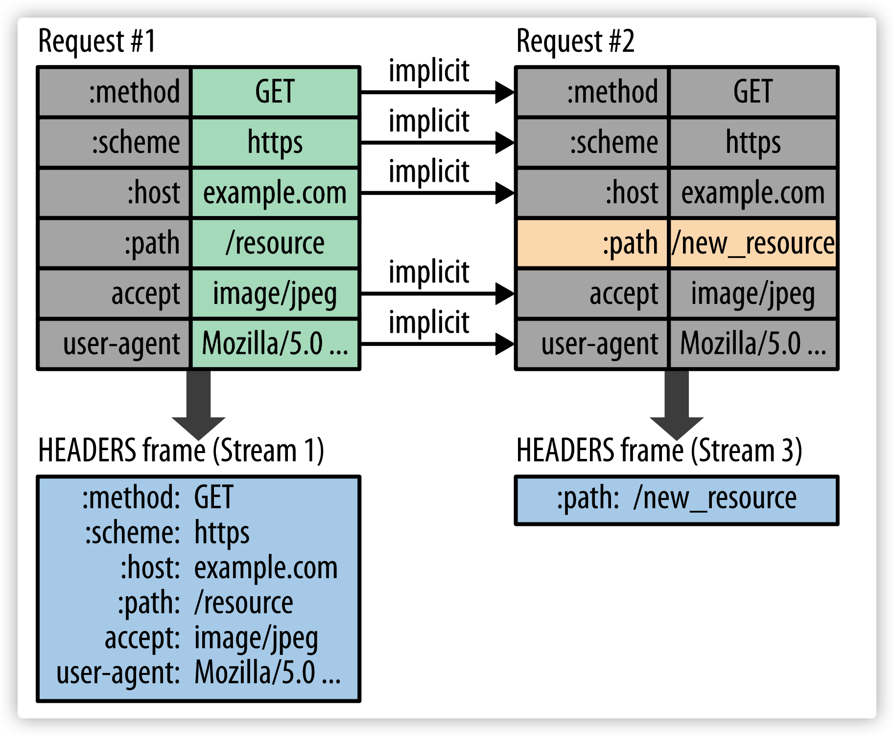

# 性能优化指南

## 性能检测工具

+ `Lighthouse` Google Chrome推出的一个开源自动化工具，作为Chrome的扩展安装

  

  > 名词解释：

  + First Contentful Paint（FCP），衡量页面开始加载到页面中第一个元素被渲染之间的时间。元素包含文本、图片、canvas等。

  + Speed Index， 速度指数，页面呈现出来的平均时间。

  + Largest Contentful Paint（LCP），衡量标准视口内可见的最大内容元素的渲染时间。元素包括img、video、div及其他块级元素。

  + Time to Interactive（TTI），首次可交互时间。页面可以开始响应用户输入事件。

  + Total Blocking Time（TBT），衡量从FCP到TTI之间主线程被阻塞时长的总和。

  + Cumulative Layout Shift（CLS，累计布局偏移），网页布局在加载期间的偏移量。

+ `PageSpeed Insights` 谷歌开发的一个免费的网页分析工具

+ `Speedcurve` 前端性能综合监控网站，可以在网站输入被测网站的 url 地址，进行测试

+ `SiteSpeed` 一款开源的，可以用于监控和检查网站性能的工具。可以通过 docker 镜像或 npm 方式来使用

## 优化事项

+ 压缩静态资源(img js html css等)

+ 减少http请求次数，将多个小文件合并为一个大文件

+ 静态资源使用 CDN 加载

+ 将css放在页面顶部，js放在页面底部

+ 图片优化
  

    
合适大小

    不同分辨率使用合适大小图片，防止加载过大图片浪费带宽
  

  

    
懒加载

  

  

    
指定明确宽高

    防止重绘
  

<!-- TODO: seo 描述 -->
+ SEO 
+ gzip

+ 使用 `requestAnimationFrame` 实现动画(兼容的情况下)

+ 使用 transform 和 opacity 属性更改来实现动画(配合 translate3D 开启硬件加速)

+ 尽量使用canvas或者css实现动画，不用dom实现

+ 使用 `http2` [参考地址](https://developers.google.com/web/fundamentals/performance/http2?hl=zh-cn)
  

    
优势

    

      
完全兼容http1

      http2是对http1的拓展，而非替代，提供的功能不变，HTTP 方法、状态代码、URI 和标头字段等这些核心概念也不变(无感切换)
    

    

      
二进制分帧

      http1使用`换行符`作为分隔符，而`http2`则将所有传输的信息分割为更小的消息和帧，并采用二进制编码，解析速度更快
    

    

      
多路复用

      http1中，多个并行请求使用多个TCP连接，并且每个连接每次只交付一个响应(响应排队)
      http2中：C和S将http消息分解为互不依赖的帧，然后交错发送，再在另一端重新组装起来
      可以减少使用针对http1的优化手段，e.g. `域名分片` `精灵图` 等
    

    

      
服务器推送

    

    

      
头部压缩

      每个http请求都会携带一个header，
      http1中：元数据始终以文本形式携带，增加开销
      http2中：通过编码+索引方式，做到类似diff算法的处理，使得相同的header字段不传输(使用索引替代)，只传输变化的
    

    

  

