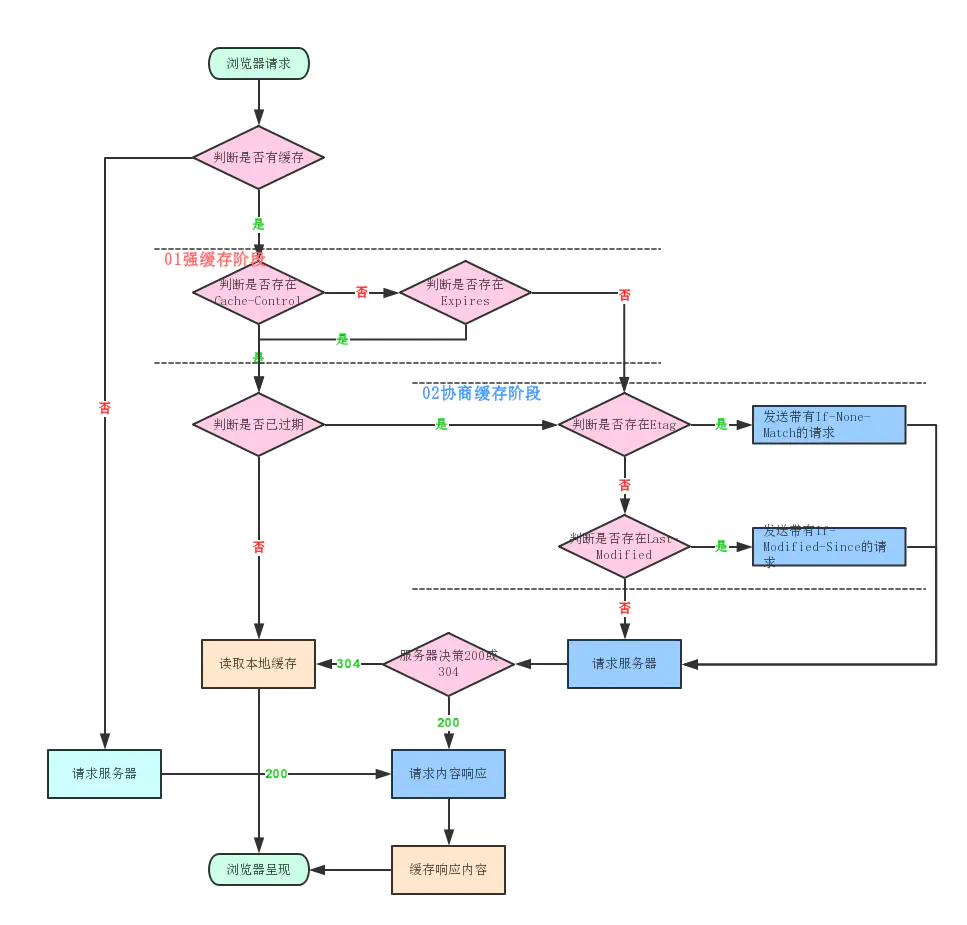

# 缓存

通过 HTTP header 中的一些字段控制

## 强缓存

> 直接走本地文件，不会发请求

+ Pragma: HTTP1.0 规范
  + 值类型：public no-cache must-revalidate
  + 用途：客户端设置请求头，禁止缓存
  + 缺陷：仅有`IE浏览器`能够识别，一般不建议使用，只是用来兼容存在http1.0请求的情况，一般推荐和 `Cache-Control `一起使用，起到兼容作用

+ Expires: HTTP1.0 规范
  + 值类型：确切的一个时间点
  + 比对方式：通过比对客户端和服务端的时间比对
  + 缺陷：如果本地时间不准确，缓存就会失去准确性

+ Cache-Control: HTTP1.1 规范
  + 值类型：
    + private      默认值，代表资源只能在客户端缓存
    + public       客户端和代理服务器都可以缓存
    + no-cache     客户端缓存内容，但是是否走缓存需要经过协商缓存确定
    + no-store     不使用缓存
    + max-age=8600 值为数字(秒) ，代表缓存在8600秒后失效

  __Cache-Control 优先级大于 Expires__

## 协商缓存

> 无论是否有缓存，都会发一次请求校验缓存是否可用

+ Last-Modified / If-Modified-Since -| 优先级低
  > 流程同上，只不过值为 `文件修改时间`

+ Etag / If-None-Match --------------| 优先级高
  + 检测原理：服务器使用特定算法，根据资源内容生成一个唯一标识(比如md5)，然后在响应时发送给客户端
  + 请求流程
    + ① 浏览器发起请求
    + ① 浏览器返回携带 etag 字段的资源
    + ② 浏览器再次发起请求
    + ② 浏览器携带 If-None-Match 字段，值为 ① 中返回的 etag
    + ② 服务端判断 If-None-Match 字段值是否和服务器上资源的 etag 符合
    + ② 符合返回状态码 304；不符合返回最新资源，状态码 200

> `Etag`是对`Last-modified`的优化处理

> `Last-Modified`存在问题：

+ 1、如果资源内容未修改，但是资源本身修改了，`Last-Modified`检测出不出来
+ 2、`Last-Modified`检测频率是以`秒`为单位的，如果文件在1秒钟修改多次，无法检测

## 参考文档
[缓存详解](https://juejin.cn/post/6844903556474994695) 
...
