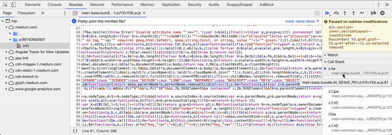

# Chrome Devtools 常用命令

## 快捷指令面板：`cmd + shift + p`

### 性能监视器 `> performance monitor`

### FPS 性能实时监控 `> fps` 选择第一项

### 黑盒脚本 `Blackbox Script`

> 断点调试，排除特定文件的脚本(第三方库等)

### 控制台内置指令

+ `$(selector, [startNode])`: 元素选择器，querySelector 的简写语法

+ `?(selector, [startNode])`: 全选择器，querySelectorAll 的简写语法
