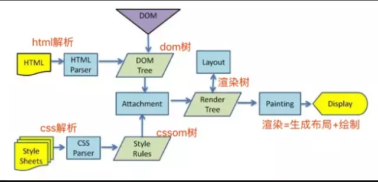

# 浏览器渲染机制&针对优化

## 网页渲染过程

+ ① HTML代码解析成DOM树
+ ② CSS代码解析成CSSOM树
+ ③ 将DOM树和CSSOM树结合成渲染树(Render Tree)
+ ④ 生成布局，即将所有渲染树的节点进行平面合成
+ ⑤ 将布局绘制在屏幕上



重新渲染需要重复执行 `4 5(重排，重绘)` 步骤，或者只执行 `5(重绘)`

## 重排、重绘

> 重排代价大于重绘，因为重排会导致重绘，但是重绘不会导致重排

+ 重排(回流、reflow)：重新生成布局，重新排列元素
  + 概念：当DOM变化引起了元素的几何信息（DOM的位置和尺寸大小），浏览器需要重新计算元素的几何属性，将其放在界面中的正确位置，这个过程叫做重排

  + 常见引发的属性或和方法
    + 添加或者删除可见DOM元素
    + 计算 offsetWidth 和 offsetHeight 属性
    + 元素尺寸改变 - margin padding border width height
    + 内容变化 - 比如用户在表单中输入文字
    + 设置 style 属性的值(尺寸相关属性)
    + *`属性列表：width height margin padding display border position overflow clientWidth clientHeight clientTop clientLeft offsetWidth offsetHeight offsetTop offsetLeft scrollWidth scrollHeight scrollTop scrollLeft scrollIntoView() scrollTo() getComputedStyle() getBoundingClientRect() scrollIntoViewIfNeeded()`*
  
  + 最佳使用姿势：尽量达到局部重排，而非全局重排
    > 当 p 元素发生 `reflow` 时，`h4` 和 `body` 也会重新渲染，甚至 `ol` 和 `H5` 都会
    ```html
      <body>
        <div class="hello">
          <h4>hello</h4>
          <p><strong>Name:</strong>BDing</p>
          <h5>male</h5>
          <ol>
            <li>coding</li>
            <li>loving</li>
          </ol>
        </div>
      </body>
    ```
    局部范围重排：将一个DOM元素的集合信息定死，然后在此DOM内部进行重排，则只会重渲DOM内部元素

+ 重绘(repaint)：改变某些元素的外观 e.g. 颜色、opacity
  + 概念：当元素外观发生改变，但并未改变布局，重新渲染元素外观的过程，叫做重绘
  + 常见引发的属性：`color border-style visibility background text-decoration background-image background-position background-repeat outline-color outline outline-style border-radius outline-width box-shadow background-size`

## 浏览器的渲染队列

+ 以下代码引发几次重排

```js
  div.style.left = '10px'
  div.style.top = '10px'
  div.style.width = '20px'
  div.style.height = '20px'
```

<details>
  <summary></summary>
  答案是：一次<br>
  原因：得益于浏览器的 <strong>渲染队列机制</strong> 当我们触发 <strong>重排</strong>或者<strong>重绘</strong>时，浏览器会将该操作放进渲染队列，等到队列中的操作达到 <strong>一定的数量或者一定的时间间隔</strong> 时，浏览器会批量执行这些操作
</details>

+ 强制刷新队列

```js
  div.style.left = '10px'
  console.log(div.offsetLeft)
  div.style.top = '10px'
  console.log(div.offsetTop)
  div.style.width = '20px'
  console.log(div.offsetWidth)
  div.style.height = '20px'
  console.log(div.offsetHeight)
```

+ 引发属性：`offsetTop, offsetLeft, offsetWidth, offsetHeight scrollTop, scrollLeft, scrollWidth, scrollHeight clientTop, clientLeft, clientWidth, clientHeight getComputedStyle(), 或者 IE的 currentStyle`

## 重排优化建议

+ 分离读写操作

```js
  // 只触发一次
  div.style.left = '10px'
  div.style.top = '10px'
  div.style.width = '20px'
  div.style.height = '20px'
  console.log(div.offsetLeft)
  console.log(div.offsetTop)
  console.log(div.offsetWidth)
  console.log(div.offsetHeight)
```

+ 样式集中改变

```js
  div.style.left = '10px'
  div.style.top = '10px'
  div.style.width = '20px'
  div.style.height = '20px'

  // or
  el.className += ' px-size'
```

+ 缓存布局信息(约等于读写分离)

```js
  const left = el.offsetLeft
  const top = el.offsetTop
  el.style.left = left + 1 + 'px'
  el.style.top = top + 1 + 'px'
```

+ 离线改变DOM
  + display：none；修改之前将元素隐藏，修改后在放出来
  + 使用 DocumentFragment 创建文档碎片，在其上修改完成后在添加到文档中
  + 复制节点，在副本上操作，再替换掉

+ position 属性为 absolute 或者 fixed
